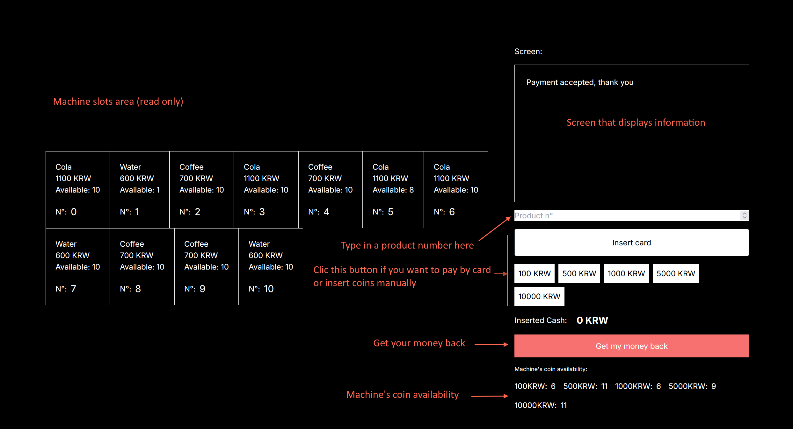

Vending machine interview project

## Getting Started

You can run the project localy using:

```bash
npm run dev
```
And use it on [http://localhost:3000](http://localhost:3000) in your browser

The project is also uploaded here:

https://vending-machine-ashen.vercel.app/


## Interface guide



## Goal

The goal of the project was to design a vending machine system.
I joined in my subscription the diagram that I made before starting the coding part.

## Technologies

The position I applied for is a Frontend engineering position therefore I decided to use **React** in NextJS to realize this project.

I did not use any database to store the data as I thought it was not relevant to what is being evaluated.

## Feedback
It was a very interesting project that I was excited to realize. I did not encounter any difficulties.
For the feature about paying back the customer I think a use case where a dynamic programming would have been worth doing would have been interesting.
